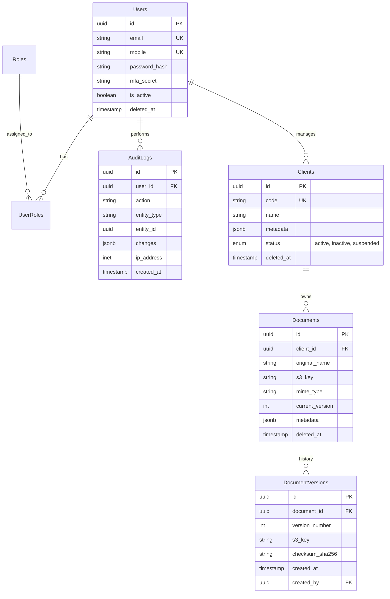

# Database & Data Layer Design

## 1. Executive Summary & Recommendation

### Recommendation: **PostgreSQL** (v15+)

While the current project setup utilizes `mysql2` and `sqlite3`, we strongly recommend migrating to **PostgreSQL** for the production environment.

**Rationale:**

- **JSONB Support**: Superior handling of semi-structured data which will be critical for `Documents` metadata and `Audit Logs`. Postgres generic indexing on JSONB is significantly more performant than MySQL's implementation.
- **Concurrency (MVCC)**: Better performance under heavy concurrent read/write loads, avoiding the gap-locking issues common in MySQL default isolation levels.
- **Extensions Ecosystem**: Access to powerful extensions like `pg_trgm` (fuzzy search for document names), `pgcrypto` (hashing/encryption), and `PostGIS` (if location data is ever needed).
- **Licensing**: Truly open source (PostgreSQL License/BSD-like) vs Oracle's GPL/Commercial mix for MySQL.

---

## 2. Optimized Schema Design

### 2.1 Entity Relationship Diagram (Conceptual)

### 2.2 Table Definitions (TypeScript / ORM Config)

#### Users Table

- **Enhancement**: Added `email` for standard auth, `mfa_secret` for security.
- **Index**: `email` (Unique), `mobile` (Unique), `deleted_at` (Partial Index: `idx_users_active` where `deleted_at IS NULL`).

#### Clients Table

- **Enhancement**: Added `metadata` (JSONB) for flexible industry-specific fields without schema changes.
- **Index**: `code` (Unique), `status`, `metadata` (GIN Index for search).

#### Documents & Versioning

- **Strategy**: **Immutable Versions**.
- The `documents` table holds the "Head" pointer (current metadata).
- The `document_versions` table holds the history.
- **Soft Delete**: `deleted_at` on `documents`. `document_versions` are strictly archival and generally not deleted unless purging.

#### Audit Logs

- **Storage**: JSONB for `changes` column storing `{ "before": {...}, "after": {...} }`.
- **Partitioning**: Recommended generic partitioning by `created_at` (Monthly) if logs exceed 10M rows/year.

#### Access Control (RBAC)

- **Tables**: `roles`, `permissions`, `role_permissions`, `user_roles`.
- **Features**: Granular permissions (e.g., `document:read`, `client:edit`).

---

## 3. Data Strategy

### 3.1 Soft Delete

- **Implementation**: All mutable tables (`users`, `clients`, `documents`) will have a `deleted_at` (Timestamp, Nullable) column.
- **ORM Handling**: Enable Sequelize `paranoid: true`.
- **Database Enforcement**: Use partial unique indexes to allow unique constraints to work with soft deletes (e.g., allow multiple deleted users with email `a@b.com`, but only one active one).
  - _Postgres Syntax_: `CREATE UNIQUE INDEX idx_users_email_unique ON users (email) WHERE deleted_at IS NULL;`

### 3.2 Backup & Recovery (DR)

- **RPO (Recovery Point Objective)**: 5 Minutes.
- **RTO (Recovery Time Objective)**: 1 Hour.
- **Strategy**:
  1.  **Continuous Archiving**: Enable WAL (Write Ahead Log) archiving (Postgres) or Binlog (MySQL) to S3.
  2.  **Daily Snapshots**: Automated nightly full backups.
  3.  **Point-in-Time Recovery (PITR)**: Ability to restore to any second in the last 7-35 days using Base Backup + WAL replay.
- **Off-site**: Replicate backups to a different AWS Region (Cross-Region Replication) for DR.

### 3.3 Encryption at Rest

1.  **Disk Level (Recommended)**: Use AWS RDS Storage Encryption (AES-256). This protects against physical drive theft.
2.  **Application Level (Sensitive Fields)**:
    - User `mobile` or `email` if PII requirements are strict.
    - `mfa_secret` and any API keys stored in DB.
    - **Algorithm**: AES-256-GCM. Keys managed via AWS KMS or HashiCorp Vault.

### 3.4 Scaling: Read Replicas & Sharding

- **Phase 1 (Current)**: Single Writer + 1 Standby (for Failover).
- **Phase 2 (Scale Read)**: Add Read Replicas. Offload `AuditLog` queries and `Reporting` queries to replicas.
- **Phase 3 (Sharding - Future)**:
  - **Shard Key**: `client_id`.
  - Most data is scoped to a Client. We can shard `documents` and `audit_logs` by `client_id`.
  - Users might need a global lookup table if they span shards, or Sharding middleware.

## 4. Implementation Checklist

- [ ] Install PostgreSQL drivers (`pg`, `pg-hstore`).
- [ ] Update ORM Config (`src/config/database.config.ts`) to support Postgres dialect.
- [ ] Create Migration Scripts for new Schemas.
- [ ] Implement `BaseModel` class with `deleted_at` logic.
- [ ] Configure `AuditLogService` middleware to intercept write actions.
